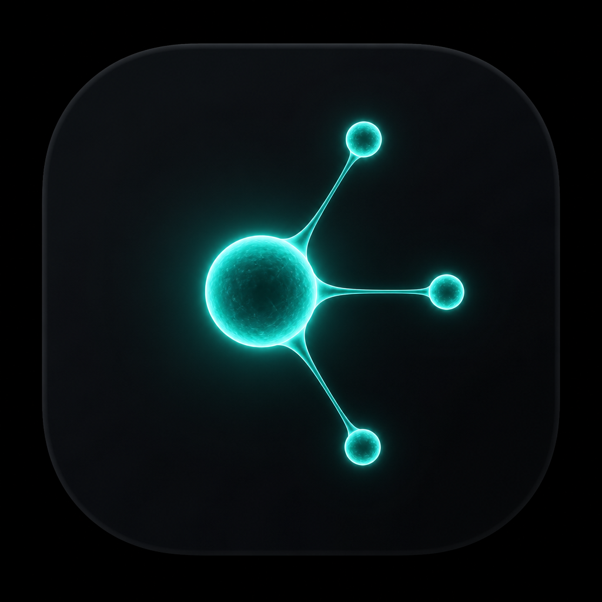
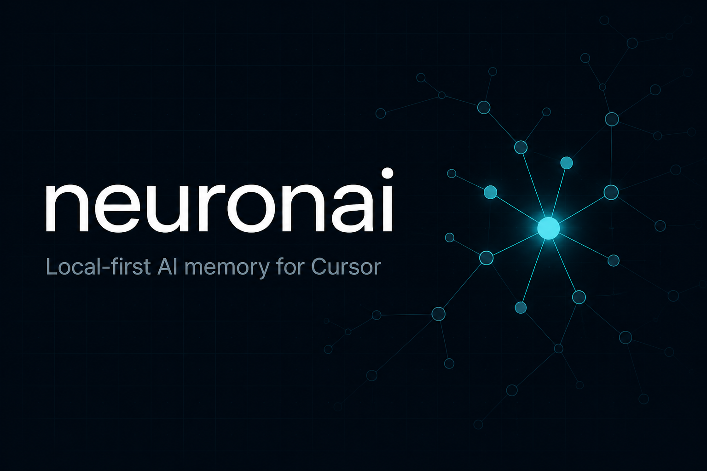
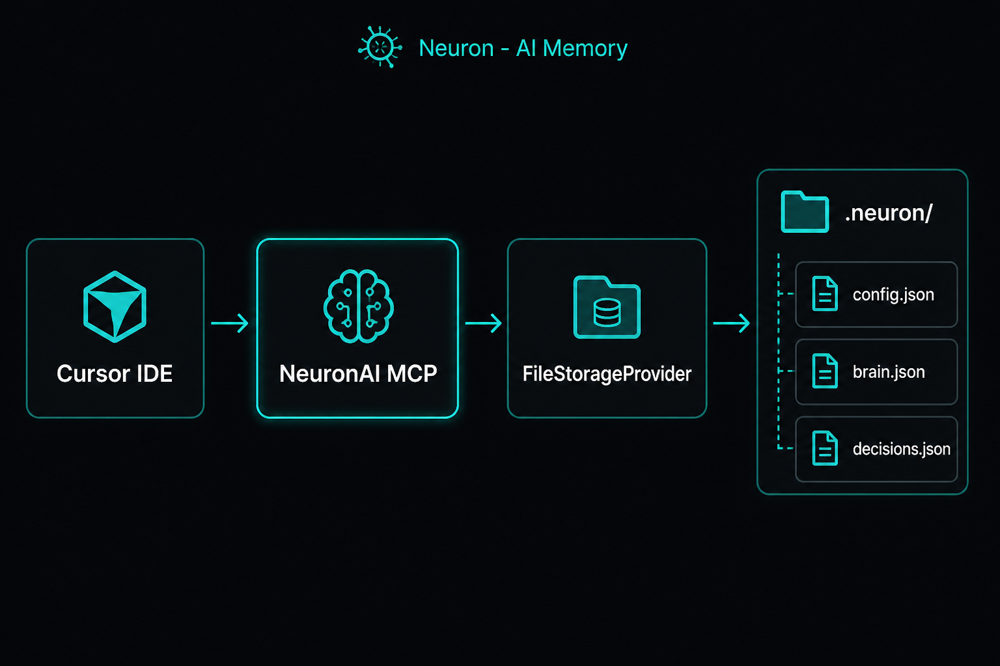
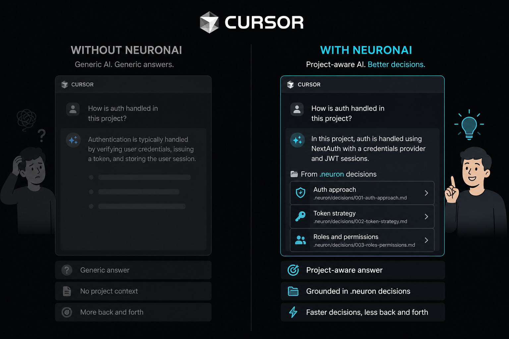
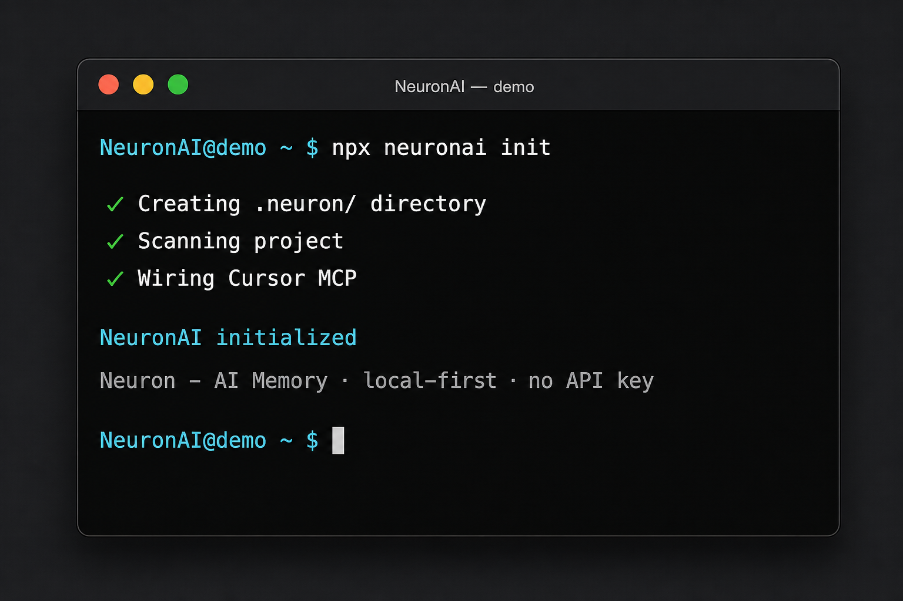
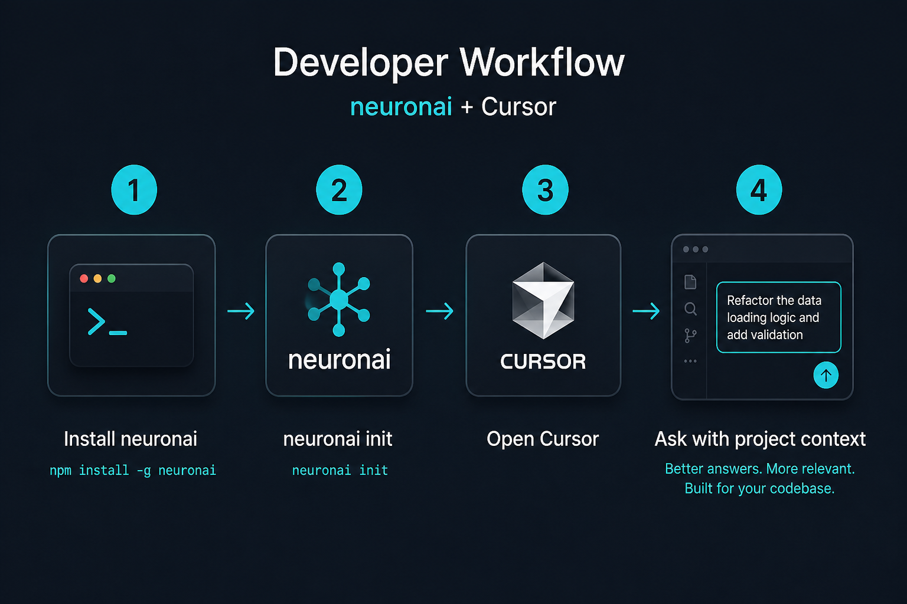
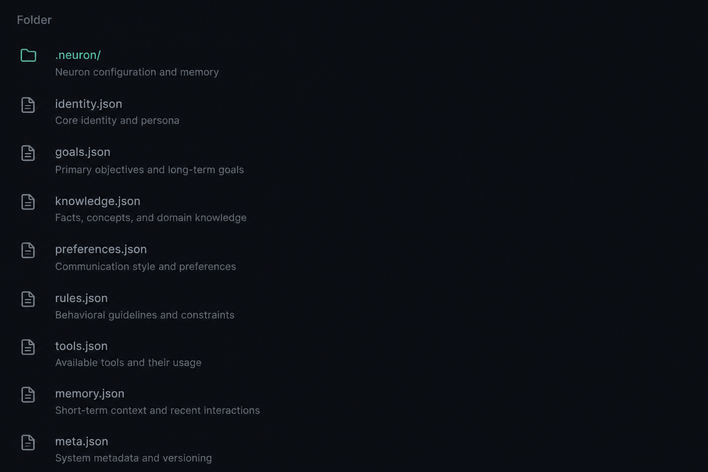
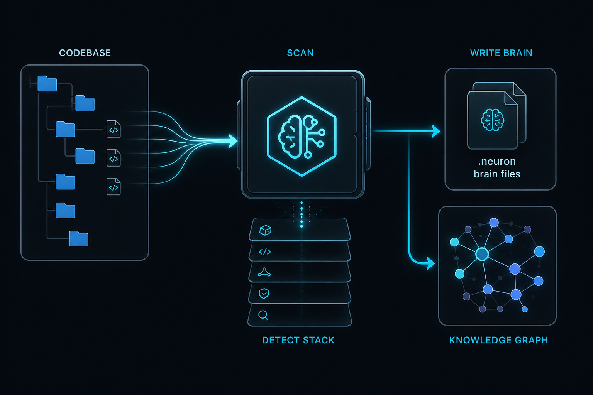
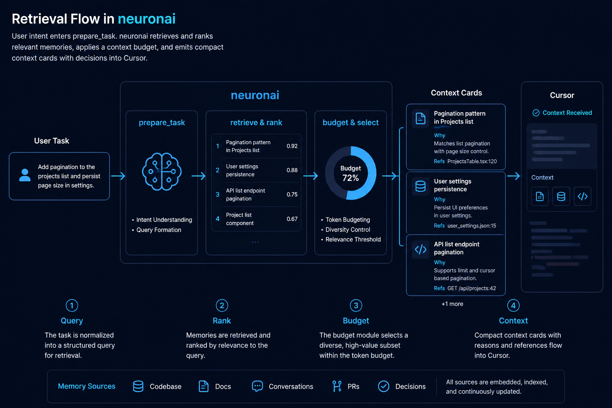
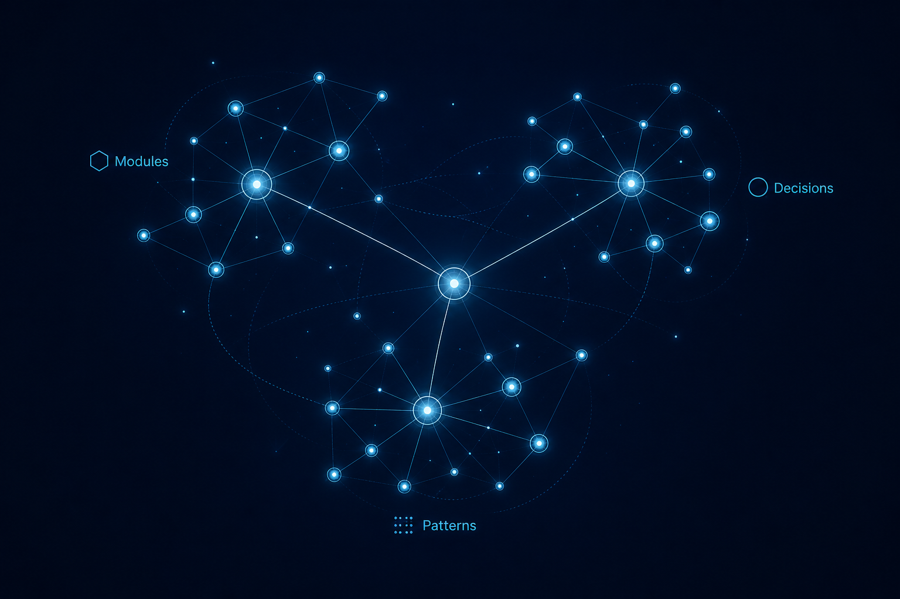

<p align="center">
  
</p>

<h1 align="center">NeuronAI</h1>

<p align="center"><b>Neuron - AI Memory</b></p>

<p align="center">Local-first project memory for Cursor.</p>

<p align="center">
  <a href="https://github.com/tokpl/neuronai"></a>
  <a href="./LICENSE"></a>
  <a href="https://nodejs.org"></a>
  
  
  <a href="https://www.npmjs.com/package/neuronai"></a>
</p>

<p align="center">
  <a href="#installation"><b>Install</b></a> ·
  <a href="#quick-start"><b>Quick Start</b></a> ·
  <a href="#faq"><b>FAQ</b></a>
</p>



---

## Problem

Cursor starts almost every chat from zero.

It forgets:

- why you chose Postgres over Mongo
- which module owns payments
- that controllers must not open the database
- the footgun that burned last sprint

A bigger context window does not fix this. Repo RAG finds *code*. It does not remember *engineering judgment*.

---

## Solution

**NeuronAI** is **Neuron - AI Memory**: a local project brain for Cursor.

1. Scans your repo into `.neuron/`
2. Stores decisions, patterns, and warnings on disk
3. Exposes them to Cursor through a small MCP tool set
4. Shares with the team via Git (`git pull`)

No Docker. No Postgres. No API keys. No cloud account. Telemetry off by default.



---

## Before vs After

> Add a refund flow

| Cursor alone | Cursor + NeuronAI |
|--------------|-------------------|
| Invents a new DB client in a route handler | Loads your payment / outbox decisions |
| Skips domain layer | Respects existing module boundaries |
| Misses past mistakes | Surfaces known warnings first |



---

## Demo



```bash
npx neuronai init
# or: npm install -g neuronai && neuron init
```

Open the project in Cursor, then **enable MCP** (servers stay off until you do):

1. **Cursor Settings → Tools & MCP**
2. Find **neuron** → **Enable**
3. Wait for a green status (not Error)

Then ask:

> Prepare adding a refund flow using NeuronAI



---

## Features

1. **One-command init** - wires `.neuron/` + Cursor MCP
2. **Project scan** - bootstrap brain from the codebase
3. **Local file storage** - readable JSON under `.neuron/`
4. **12 MCP tools** - prepare, search, save, review, scan
5. **Budgeted context** - top facts for *this* task
6. **Git Team Brain** - commit brain JSON; teammates get it on pull
7. **Zero secrets required** - no API key for NeuronAI itself
8. **Privacy default** - local-only, telemetry OFF
9. **Cursor-first DX** - rules, skills, MCP in `.cursor/`

---

## Installation

```bash
npm install -g neuronai
```

Or:

```bash
npx neuronai init
```

After global install you can use either:

```bash
neuronai init
neuron init
```

---

## Quick Start

```bash
npm install -g neuronai
cd your-project
neuron init
```

1. Creates `.neuron/`
2. Scans the project
3. Wires Cursor MCP

Enable MCP in Cursor: **Settings → Tools & MCP → neuron → Enable**.

Then ask Cursor:

> Prepare adding rate limiting using NeuronAI

---

## Folder Structure



```text
.neuron/
  config.json
  brain.json
  knowledge.json
  decisions.json
  rules.json
  graph.json
  cache/      # gitignored
  runtime/    # gitignored
  indexes/    # gitignored
  logs/       # gitignored
```



---

## How It Works

```text
Project -> Scanner -> Memory (.neuron/) -> Knowledge Graph -> MCP -> Cursor
```




---

## FAQ

**Postgres / Docker / API key?** No.

**Team share?** Commit `.neuron/*.json`. `git pull` is the Team Brain.

**AI agent?** No - Neuron - AI Memory for Cursor.

**VS Code?** No - Cursor-first.

More: [`docs/faq.md`](./docs/faq.md)

---

## Contributing

[`CONTRIBUTING.md`](./CONTRIBUTING.md) · [`CODE_OF_CONDUCT.md`](./CODE_OF_CONDUCT.md)

## Security

[`SECURITY.md`](./SECURITY.md)

## License

NeuronAI’s **source code** is licensed under the [Apache License 2.0](./LICENSE).

You may use, modify, and distribute the software under those terms. See also [`NOTICE`](./NOTICE).

## Trademark

**NeuronAI** and **Neuron - AI Memory** identify this project. The Apache License does **not** grant trademark rights to the name or logo.

- Code stays open source (local NeuronAI remains Apache-2.0)
- The brand and logo are covered by [`TRADEMARK.md`](./TRADEMARK.md)
- Future Cloud / hosted services may be offered separately; they are optional and do not replace the local OSS product

---

<p align="center">
  <a href="https://github.com/tokpl/neuronai">github.com/tokpl/neuronai</a>
</p>
