<p align="center">
  
</p>

<h1 align="center">NeuronAI</h1>

<p align="center"><b>Give Cursor long-term memory.</b></p>

<p align="center">
  Your AI finally remembers everything about your project.
</p>

<p align="center">
  <a href="https://github.com/tokpl/neuronai"></a>
  <a href="./LICENSE"></a>
  
  <a href="https://www.npmjs.com/package/neuronai"></a>
</p>

<p align="center">
  <a href="#quick-start"><b>Install</b></a>
  ·
  <a href="#demo"><b>Demo</b></a>
  ·
  <a href="#roadmap"><b>Roadmap</b></a>
</p>

<p align="center">
  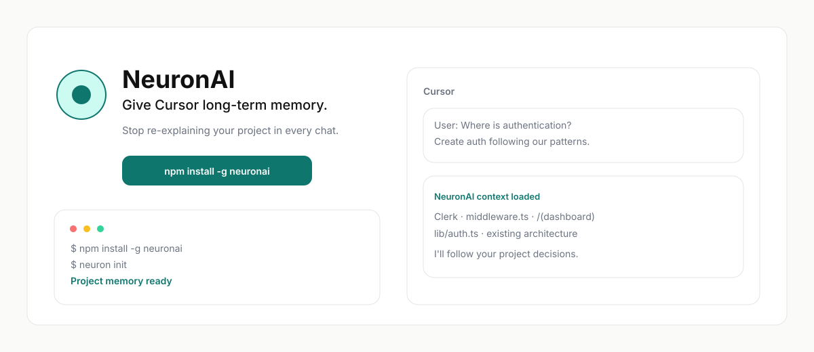
</p>

```bash
npm install -g neuronai
```

---

## The problem

<p align="center">
  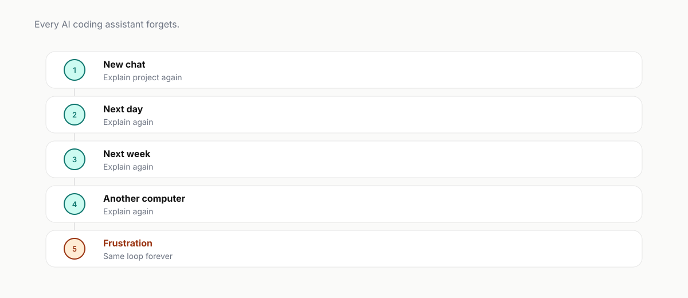
</p>

---

## NeuronAI remembers

<p align="center">
  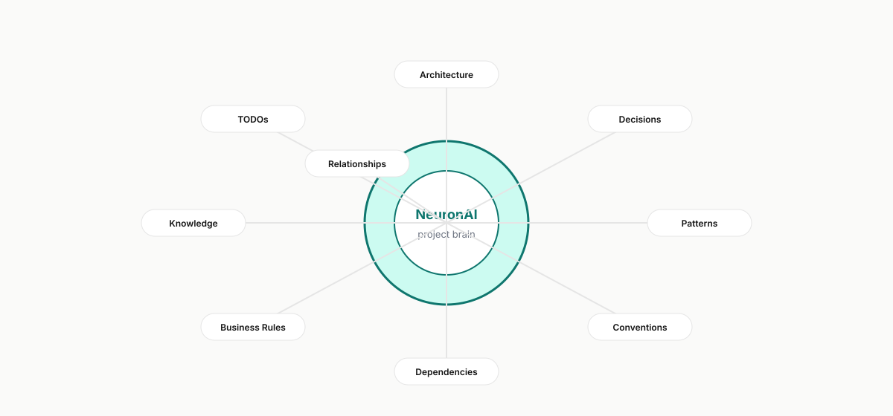
</p>

---

## Before vs After

<p align="center">
  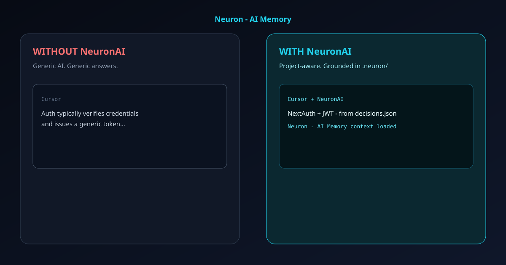
</p>

```bash
npm install -g neuronai && cd your-project && neuron init
```

---

## Demo

<p align="center">
  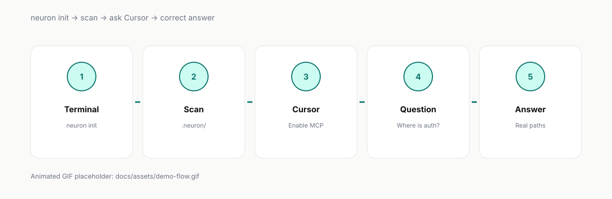
</p>

<p align="center"><i>Drop a real recording at <code>docs/assets/demo-flow.gif</code> when ready.</i></p>

---

## Why NeuronAI

<p align="center">
  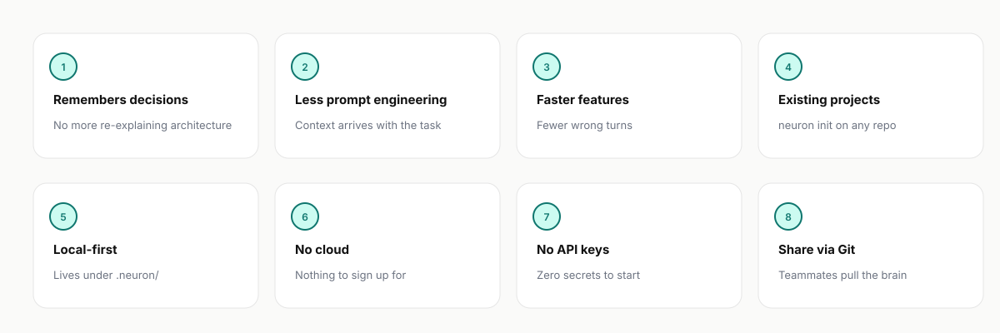
</p>

---

## How it works

<p align="center">
  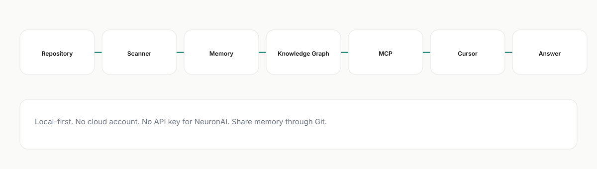
</p>

---

## Folder structure

<p align="center">
  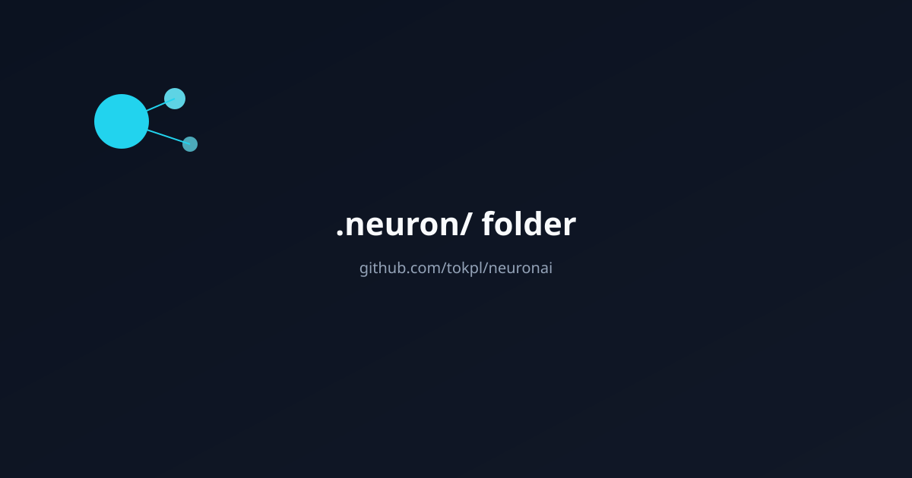
</p>

---

## Real example

<p align="center">
  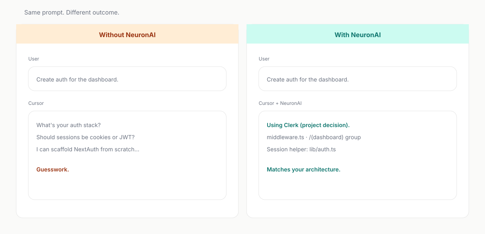
</p>

---

## Quick Start

<p align="center">
  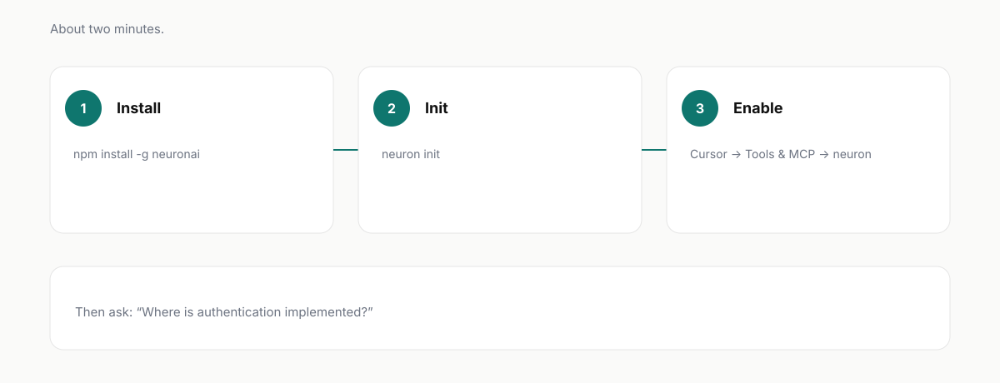
</p>

<p align="center">
  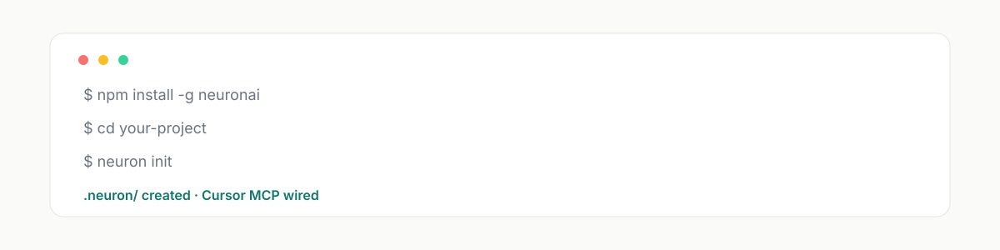
</p>

<p align="center">Then in Cursor: <b>Settings → Tools & MCP → neuron → Enable</b></p>

---

## Architecture

<p align="center">
  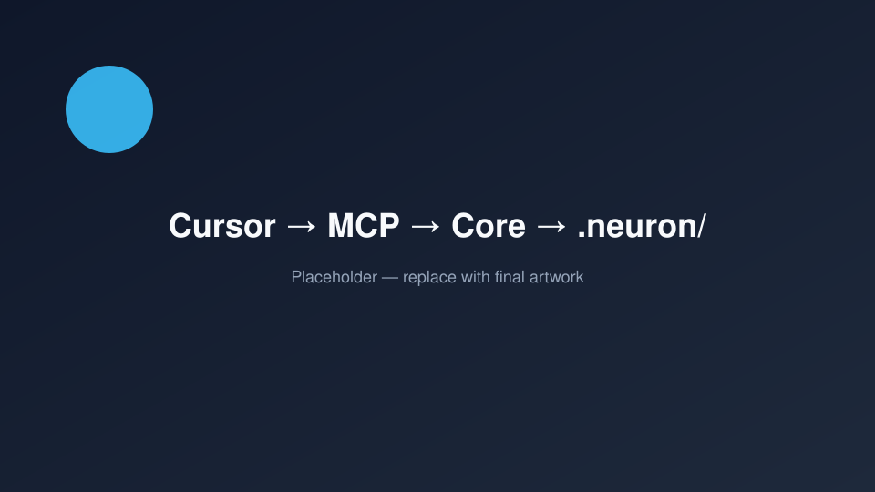
</p>

---

## Roadmap

<p align="center">
  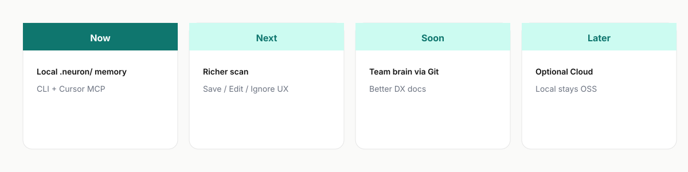
</p>

---

## FAQ

**Postgres / Docker / API key?** No.  
**Team share?** Commit `.neuron/*.json` — `git pull` is the share path.  
**AI agent?** No — long-term project memory for Cursor.  
More: [`docs/faq.md`](./docs/faq.md)

## Contributing

[`CONTRIBUTING.md`](./CONTRIBUTING.md) · [`CODE_OF_CONDUCT.md`](./CODE_OF_CONDUCT.md)

## Security

[`SECURITY.md`](./SECURITY.md)

## License

AGPL-3.0 — see [`LICENSE`](./LICENSE). Network use of modified versions requires offering corresponding source.

## Trademark

**NeuronAI** / **Neuron - AI Memory** — brand protected by [`TRADEMARK.md`](./TRADEMARK.md). License ≠ trademark.

---

<p align="center">
  <a href="https://github.com/tokpl/neuronai">github.com/tokpl/neuronai</a>
</p>
