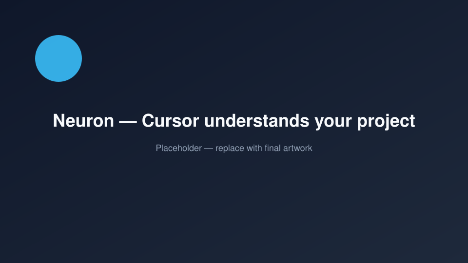
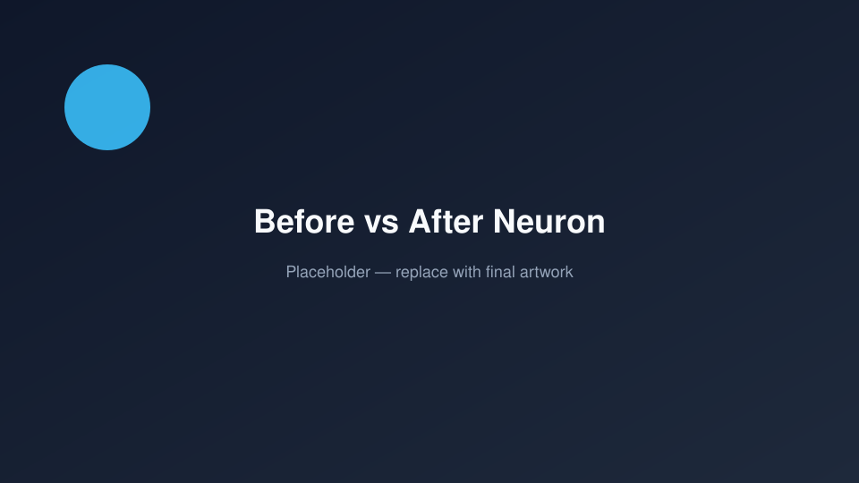
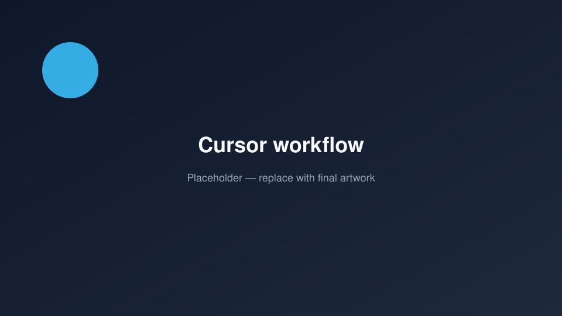
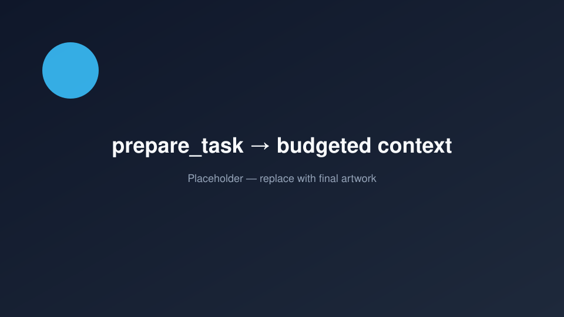
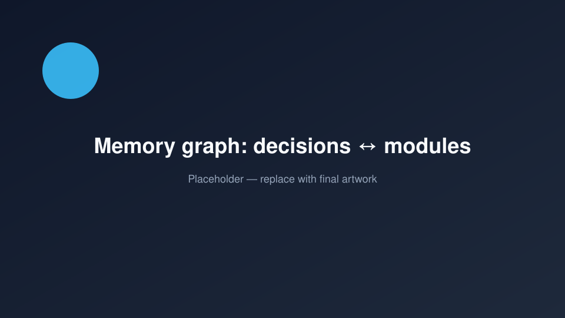
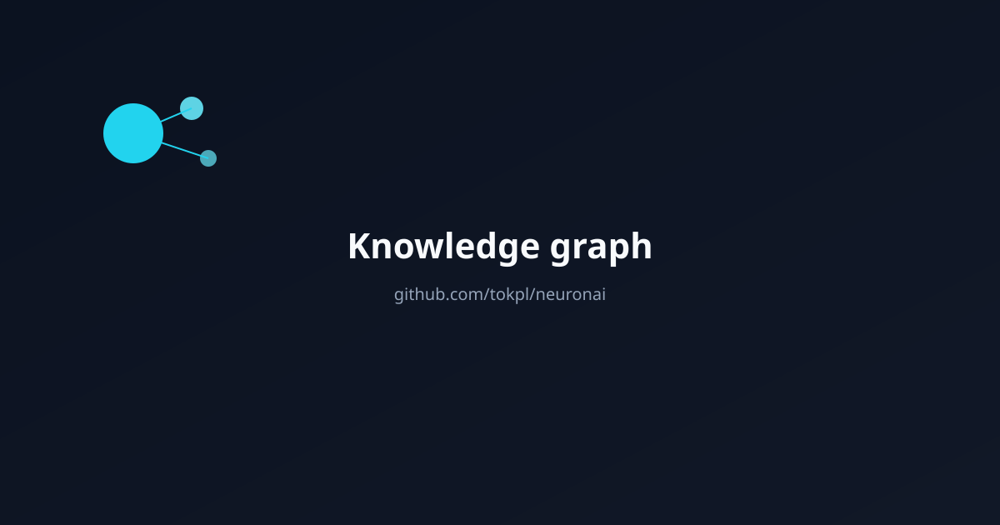

# Neuron

**Local-first AI memory for Cursor.**

Neuron makes Cursor understand your project.

[](./LICENSE)
[](https://nodejs.org)
[](./docs/neuron-folder.md)
[](./docs/mcp.md)



---

## Why Neuron?

AI coding agents forget everything between chats.

They forget why you chose Postgres. Which module owns payments. That you already banned DB access from controllers.

Repo RAG finds *code*. Neuron remembers *engineering judgment*.



| Without Neuron | With Neuron |
|----------------|-------------|
| Cursor guesses your architecture | Cursor loads decisions from `.neuron/` |
| You re-explain the same rules every session | Team shares knowledge via `git pull` |
| Generic answers | Project-aware answers |

---

## Demo


```bash
npm install -g neuron
cd my-app
neuron init
# Open in Cursor → ask anything about the project
```



---

## Quick Start

**Requirements:** Node.js 22+, [Cursor](https://cursor.com)

```bash
npm install -g neuron
cd your-project
neuron init
```

That’s it.

1. Creates `.neuron/` (local project brain)
2. Wires Cursor MCP (`.cursor/mcp.json`)
3. Scans the codebase for first memories

No Docker. No Postgres. No OpenAI API key.

Reload Cursor MCP, then ask:

> Prepare adding a payments module using Neuron

---

## How it works


```text
Cursor  →  Neuron MCP (12 tools)  →  FileStorageProvider  →  .neuron/
```



Neuron **delivers knowledge**. Cursor’s model **writes the answer**.

---

## The `.neuron/` folder


```text
.neuron/
  config.json      # project settings (git)
  brain.json       # project summary (git)
  knowledge.json   # patterns, warnings, facts (git)
  decisions.json   # architecture decisions (git)
  rules.json       # project rules (git)
  graph.json       # knowledge graph (git)
  cache/           # ignored
  runtime/         # ignored
  indexes/         # ignored
  logs/            # ignored
```

Team Brain for MVP = **Git**. `git pull` brings the project brain.





---

## MCP tools (MVP)

Only **12** tools — enough for daily use, not a catalog of 100+:

| Tool | Purpose |
|------|---------|
| `neuron_prepare_task` | Ranked context before coding |
| `neuron_get_context` | Context on demand |
| `neuron_search_memory` | Search knowledge |
| `neuron_save_decision` | Save a decision |
| `neuron_store_memory` | Store pattern / warning / fact |
| `neuron_update_memory` | Versioned update |
| `neuron_review_memory` | Suggest what to remember |
| `neuron_after_task` | Save / Edit / Ignore prompt |
| `neuron_scan_project` | Bootstrap brain from code |
| `neuron_refresh_brain` | Refresh after changes |
| `neuron_project_summary` | What is this project? |
| `neuron_health` | Health check |

Full reference: [docs/mcp.md](./docs/mcp.md)

---

## What Neuron is not

- Not an AI agent / ChatGPT / Claude Code / Cursor replacement
- Not an enterprise SaaS platform
- Not a framework for everything
- Does **not** require cloud sync, websockets, or CRDTs

Neuron is the **best local memory for AI IDEs**.

---

## Documentation

- [Getting started](./docs/getting-started.md)
- [How it works](./docs/how-it-works.md)
- [`.neuron/` folder](./docs/neuron-folder.md)
- [MCP tools](./docs/mcp.md)
- [FAQ](./docs/faq.md)
- [Roadmap](./docs/roadmap.md)
- [MVP scope](./docs/mvp.md)

---

## Contributing

See [CONTRIBUTING.md](./CONTRIBUTING.md) and [CODE_OF_CONDUCT.md](./CODE_OF_CONDUCT.md).

## Security

See [SECURITY.md](./SECURITY.md).

## License

[Apache-2.0](./LICENSE)
