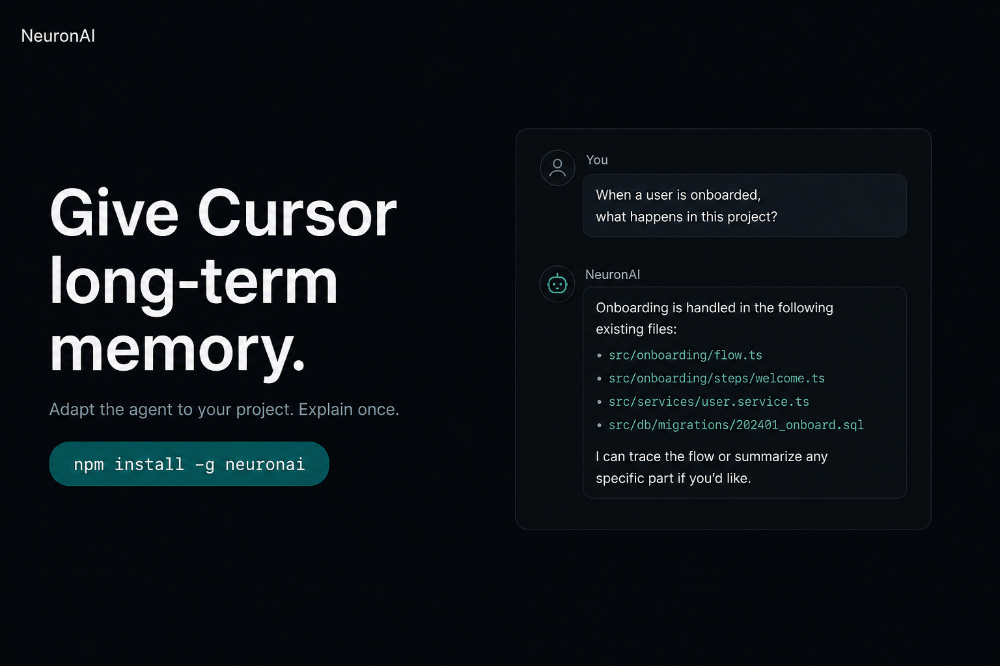
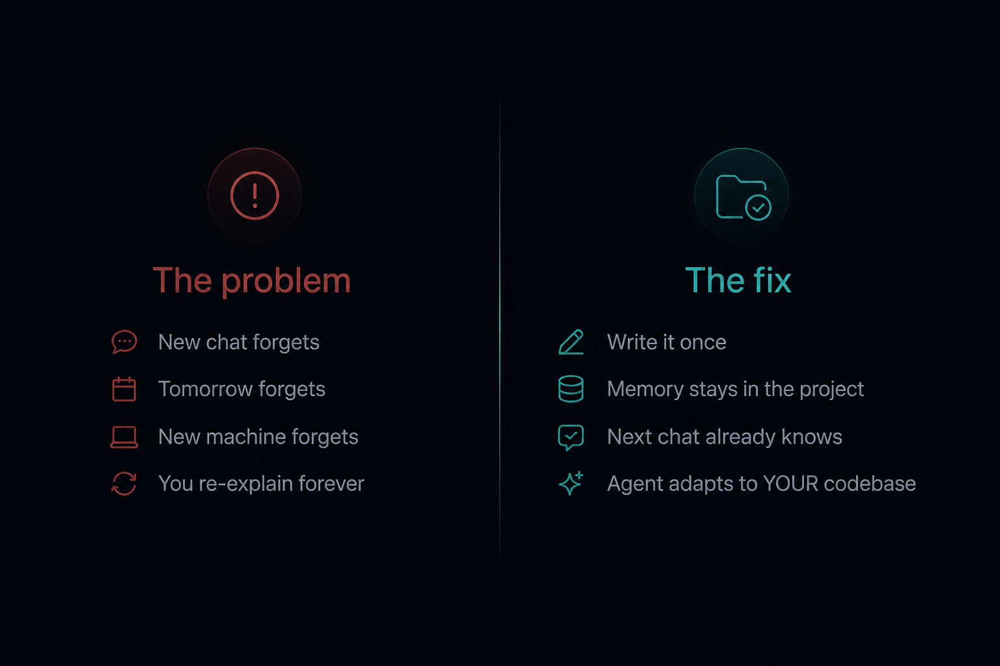
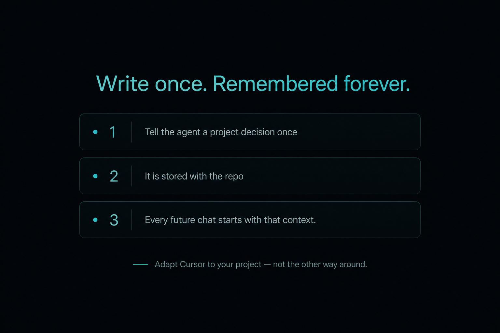
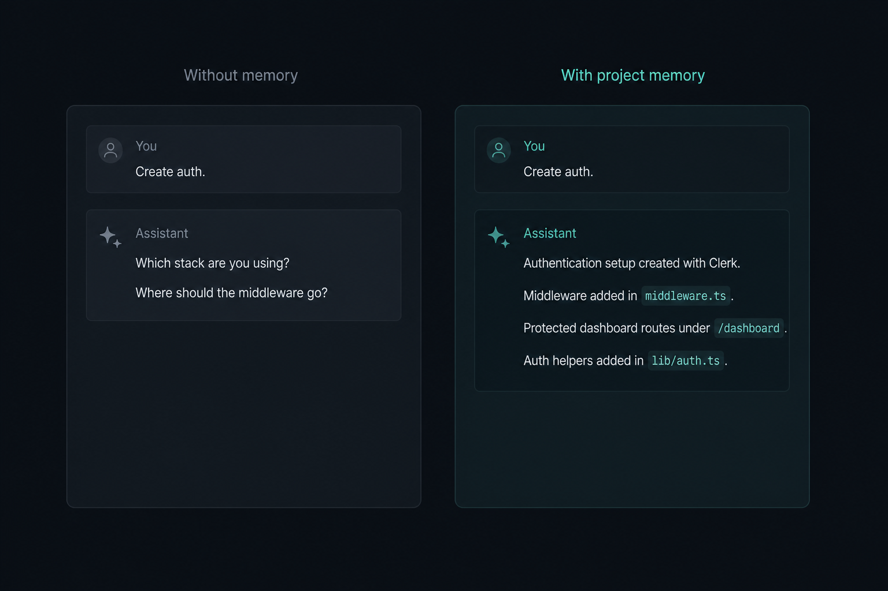
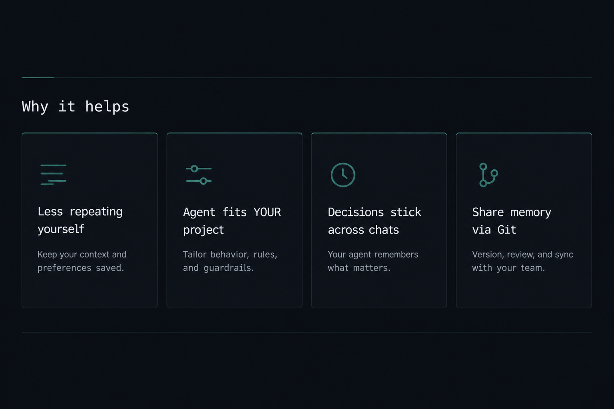
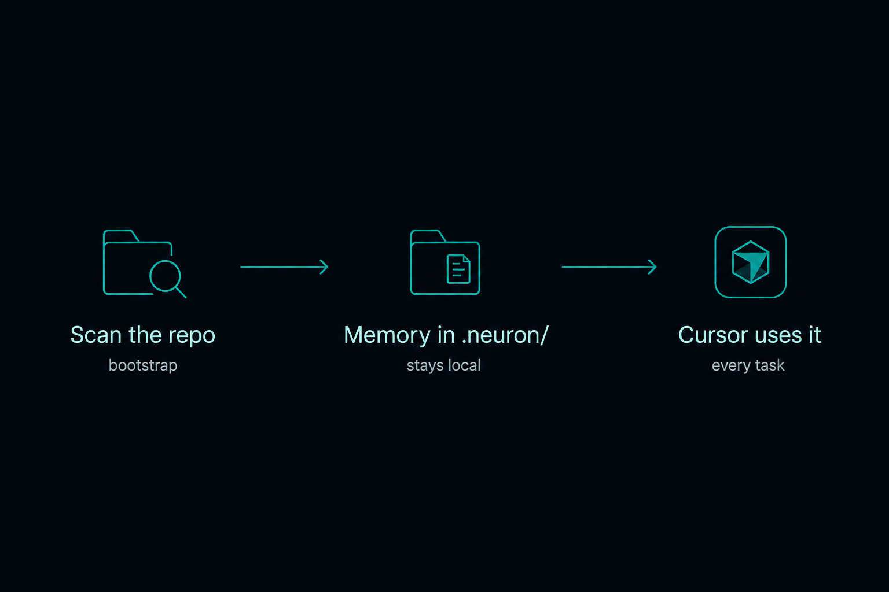
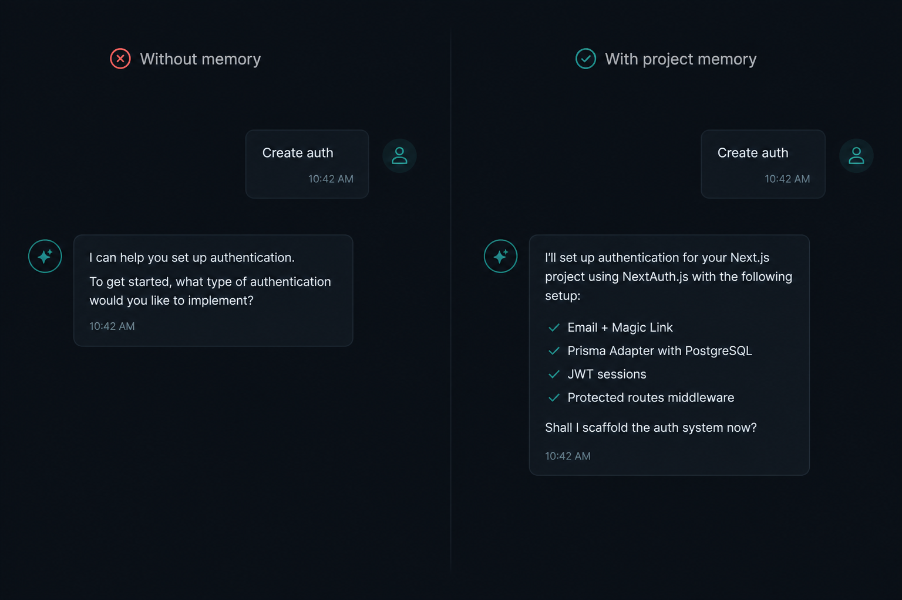
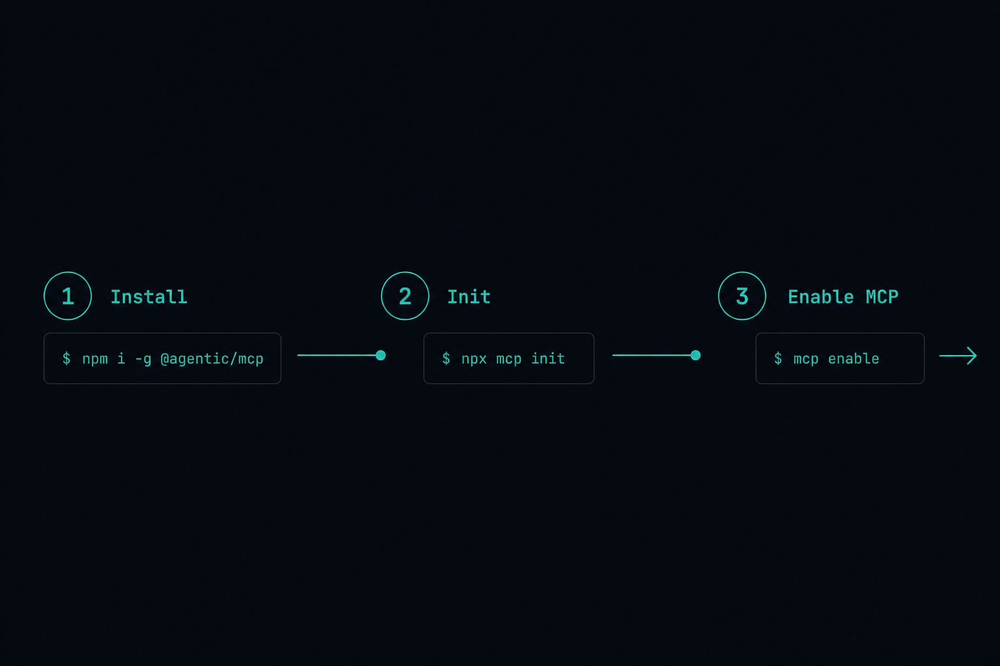
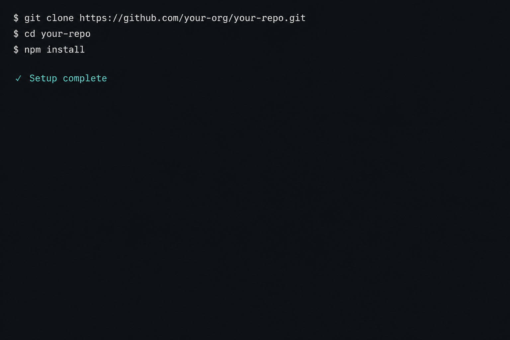
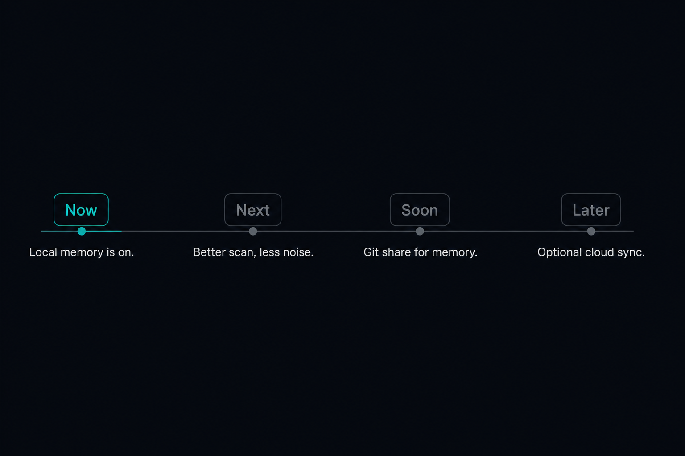

<p align="center">
  
</p>

<h1 align="center">NeuronAI</h1>

<p align="center"><b>Give Cursor long-term memory.</b></p>

<p align="center">
  Adapt the agent to your project. Explain decisions once — every next chat already knows.
</p>

<p align="center">
  <a href="https://github.com/tokpl/neuronai"></a>
  <a href="./LICENSE"></a>
  
  <a href="https://www.npmjs.com/package/neuronai"></a>
</p>

```bash
npm install -g neuronai
```

<br/>

<p align="center">
  
</p>
<p align="center">
  
</p>
<p align="center">
  
</p>
<p align="center">
  
</p>
<p align="center">
  
</p>
<p align="center">
  
</p>
<p align="center">
  
</p>
<p align="center">
  
</p>
<p align="center">
  
</p>
<p align="center">
  
</p>
<p align="center">
  
</p>
<p align="center">
  
</p>
<p align="center">
  
</p>

<br/>

```bash
npm install -g neuronai && cd your-project && neuron init
```

---

**FAQ** — No Postgres / Docker / API key. Share `.neuron/*.json` via Git. Cursor-first. More: [`docs/faq.md`](./docs/faq.md)

[`CONTRIBUTING`](./CONTRIBUTING.md) · [`SECURITY`](./SECURITY.md) · [`LICENSE` AGPL-3.0](./LICENSE) · [`TRADEMARK`](./TRADEMARK.md)

<p align="center">
  <a href="https://github.com/tokpl/neuronai">github.com/tokpl/neuronai</a>
</p>
